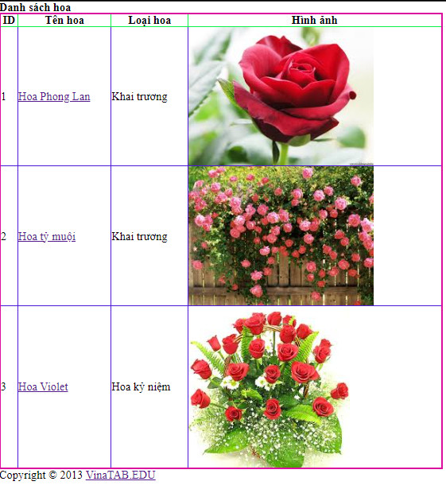

# Cho danh sách hoa như sau:
```js
const listHoa = [
    {
        id: 1,
        tenHoa: 'Hoa Phong Lan',
        loaiHoa: 'Khai trương',
        hinhAnh: 'hoa1.jpg'
    },
    {
        id: 2,
        tenHoa: 'Hoa tỷ muội',
        loaiHoa: 'Khai trương',
        hinhAnh: 'hoa2.jpg'
    },
    {
        id: 3,
        tenHoa: 'Hoa Violet',
        loaiHoa: 'Hoa kỷ niệm',
        hinhAnh: 'hoa3.jpg'
    }
]
```
Viết chương trình để render ra danh sách hoa như sau:

